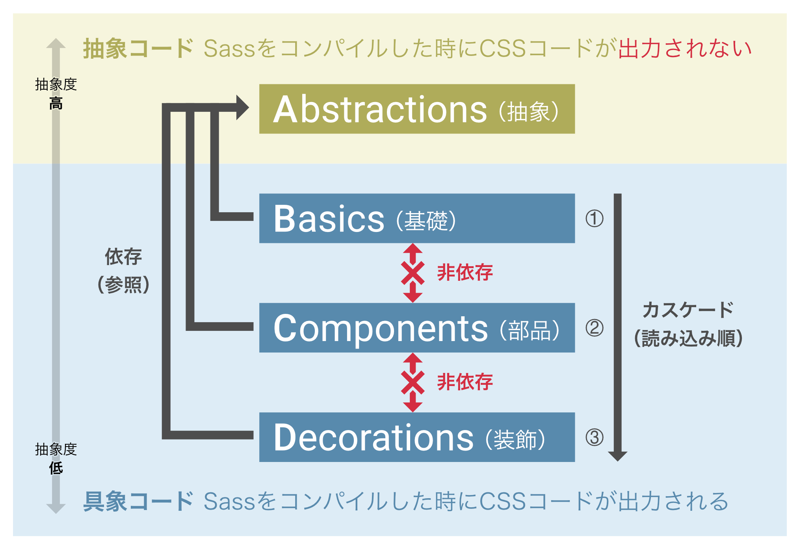

# [WIP] CSS ガイドライン

## 目次

- [スタイルガイド](#styleguide)
- [対象環境](#target)
- [デザインデータおよび技術要件](#design-spec)
- [フレームワーク](#framework)
- [エントリーポイント](#entry-points)
- [グローバル CSS](#global-css)
  - [概念図](#conceptual-diagram)
  - [構成例](#configuration-example)
- [スコープ付き CSS](#scope-css)
- [アセット](#assets)
  - [画像・SVG](#img-svg)
  - [アイコン](#icons)
  - [Web フォント](#web-fonts)
- [コーディングルール](#coding-rules)
  - [一時的な CSS の定義場所](#extras-temp)
  - [コンポーネントの命名規則](#component-naming)
  - [変数・関数・mixin の命名規則](#variables-naming)
  - [分類用プレフィックス](#abc-prefix)
  - [ローカルスコープを表すプレフィックス](#local-scope-prefix)
  - [JavaScript から参照・操作するセレクタのプレフィックス](#js-prefix)
  - [ベンダープレフィックス](#vendor-prefix)
  - [extend 機能の使用禁止](#sass-extend)
  - [Lint ツール](#lint)
  - [コードフォーマット](#code-format)
  - [SCSS ファイルの書式](#file-format)

<a name="styleguide"></a>

## スタイルガイド

スタイルやコンポーネントの使用例を見ることができるスタイルガイドページは、development 環境では http://localhost:6006/ にアクセスすると閲覧できます。

<a name="target"></a>

## 対象環境

今回のプロジェクトで想定する主要な対象デバイスは **スマートフォン環境** です。  
対象となるデバイス・OS・ブラウザーは以下になります。

- スマートフォン環境
  - iOS
    - Mobile Safari 最新版
    - Chrome は対象外
  - Android
    - Chrome 最新版
    - Android Browser は対象外
  - 画面解像度
    - 最小横幅： 360px (Androidの一般的サイズ) または 375px (iPhone 6 サイズ)
    - 最大横幅： 767.98px ([Bootstrap 4](http://getbootstrap.com/docs/4.3/layout/grid/#grid-options) の Small の上限)
    - 画像素材の高解像度(Retina)対応は @2x で必要
  - レスポンシブ対応
    - 各ブレイクポイントの値： [Bootstrap 4](http://getbootstrap.com/docs/4.3/layout/grid/#grid-options) のデフォルト値を使用
  - 対象外の環境で表示した場合
    - 何もしない
- タブレット環境
  - iOS
    - スマートフォン環境と同じ
  - Android
    - 対象外
  - 画面解像度
    - 最小横幅： 768px ([Bootstrap 4](http://getbootstrap.com/docs/4.3/layout/grid/#grid-options) の Medium の下限)
    - 最大横幅： 1199.98px ([Bootstrap 4](http://getbootstrap.com/docs/4.3/layout/grid/#grid-options) の Large の上限)
  - 対象外の環境で表示した場合
    - スマートフォン環境と同じ
- デスクトップ環境
  - Windows
    - Chrome 最新版
    - Firefox 最新版
    - Edge 最新版
  - Mac
    - Chrome 最新版
    - Firefox 最新版
    - Safari 最新版
  - 画面解像度
    - 最小横幅： 1200px ([Bootstrap 4](http://getbootstrap.com/docs/4.3/layout/grid/#grid-options) の Extra large の下限)
    - 最大横幅： 指定なし
    - 画像素材の高解像度(Retina)対応は @2x で必要
  - 対象外の環境で表示した場合
    - スマートフォン環境と同じ

### 対象環境の表示確認方法

対象環境の各 OS・ブラウザーでの表示確認は実機で行える範囲は実機で行いますが、それが困難な環境は iOS/Android のシミュレーターや Microsoft(modern.ie) の [Virtual machines](https://developer.microsoft.com/en-us/microsoft-edge/tools/vms/)、[Browser screenshots](https://developer.microsoft.com/en-us/microsoft-edge/tools/screenshots/) 等の仮想環境を使用して確認します。

<a name="design-spec"></a>

## デザインデータおよび技術要件

- デザインデータ
  - データ形式： Adobe XD, Figma, Sketch, Illustrator, Photoshop 等
  - Web フォントの有無： なし
  - Favicon 用のデータ(48px, 96px, 120px, 144px, 152px, 180px, 192px, 512px)
    - favicon.ico (48px) ※高解像度対応のため。原寸は 16px での表示
      - .ico ファイルを作成する際は、PNG ではなく減色した GIF から convert コマンドで作成
        - `$ convert icon-48.gif favicon.ico`
      - 参考： [Why is my favicon.ico file so much larger than the sum of its parts? - Stack Overflow](https://stackoverflow.com/questions/31395552/why-is-my-favicon-ico-file-so-much-larger-than-the-sum-of-its-parts)
    - iOS (120px, 152px, 180px)
      - 以下の 6 種類は、古い iOS 端末が自動的にリクエストを飛ばすことがあり、ファイルを用意していないとログに ActionController::RoutingError が残るため、これを抑止する場合は用意しておく
        - `apple-touch-icon.png`
        - `apple-touch-icon-precomposed.png`
        - `apple-touch-icon-120x120.png`
        - `apple-touch-icon-120x120-precomposed.png`
        - `apple-touch-icon-152x152.png`
        - `apple-touch-icon-152x152-precomposed.png`
    - Android (48px, 96px, 144px, 192px, 512px)
      - [ウェブアプリのインストール バナー  \|  Web  \|  Google Developers](https://developers.google.com/web/fundamentals/app-install-banners/?hl=ja)
      - 512px は PWA 対応で必要（用意してないと Lighthouse 3.0 で指摘される）
    - 参考： [favicon-cheat-sheet](https://github.com/audreyr/favicon-cheat-sheet)
    - 参考： [Polymer/pwa-starter-kit](https://github.com/Polymer/pwa-starter-kit/blob/master/index.html)
    - 参考： [All About Favicons](https://bitsofco.de/all-about-favicons-and-touch-icons/)
  - リンク各色、ウィンドウ幅増減、hover 表現などのインタラクティブ要素の確認方法
  - エラーページ (404, 422, 500, メンテナンスページ等)
  - バリデーションエラー表示
  - 通知(Flash メッセージ)表示
  - ローディング表示
  - ページネーション表示
  - Empty States 表示
  - 参考： [実装を引き受ける前に詰めておくべき Web フロントエンドの想定漏れチェックシート](https://qiita.com/y_hokkey/items/de88447bd31d9379b80a)
- 多言語対応： 日本語のみ
- テーマ対応： ダークテーマ対応は不要
- OGP対応： 必要
  - [Facebook Open Graph](https://developers.facebook.com/docs/sharing/best-practices?locale=ja_JP)
    - 必須： site_name, title, description, keywords, type の各データ
      - ページごとに個別に指定する場合は URL と上記項目の対応表が必要
    - 必須： 1200 x 630 ピクセル以上の画像
    - 任意： Facebook アプリ ID (fb:app_id)
  - [Twitter Summary Card with Large Image](https://dev.twitter.com/web/sign-inhttps://dev.twitter.com/cards/types/summary-large-image.html)
    - 必須： site_name, title, description, keywords, card の各データ
      - ページごとに個別に指定する場合は URL と上記項目の対応表が必要
    - 必須： 1200 x 630 ピクセル以上の画像(Summary Card with Large Image の場合)
    - 任意： Twitter アカウント ID (twitter:site, twitter:creator)
  - 確認方法
    - [Open Graph Debugger - Facebook for Developers](https://developers.facebook.com/tools/debug/)
    - [Card Validator - Twitter Developers](https://cards-dev.twitter.com/validator)
    - [OGP 画像シミュレータ](http://ogimage.tsmallfield.com/)
    - [OGP タグ確認に便利！ブックマークレットで手早くチェック](http://sinap.jp/blog/2012/05/ogp.html)
    - [how to test open graph on localhost - Stack Overflow](https://stackoverflow.com/questions/8569892/how-to-test-open-graph-on-localhost)
- Analytics 対応： 必要
  - Google Analytics, Mixpanel 等の HTML 貼り付け用 JS コード
    - production 環境とそれ以外で計測を分ける場合はそれぞれ必要
- テーマ対応： 不要
- 印刷対応： 不要
- 使用するプリプロセッサー
  - HTML: Haml
  - CSS: Sass (.scss)
  - JavaScript: ES6
- その他
  - 参考： [フロントエンドチェックリスト（日本語訳）](https://qiita.com/miya0001/items/8fff46c201bf9eaeba4a)

<a name="framework"></a>

## フレームワーク

今回のプロジェクトでは CSS フレームワークとして [Bootstrap 4.3](https://getbootstrap.com/docs/4.3/) を使用します。

<a name="entry-points"></a>

## エントリーポイント

今回のプロジェクトでは Rails 5.1 以降に導入された Webpacker を使用するため、CSS のエントリーポイントは以下になります。

- `app/javascript/stylesheets/basics.scss`
- `app/javascript/stylesheets/components.scss`
- `app/javascript/stylesheets/decorations.scss`
- `app/javascript/stylesheets/extras.scss`

上記は [HTTP2 環境を前提](https://blog.jxck.io/entries/2016-02-15/loading-css-over-http2.html)としているためエントリーポイントが複数ファイルに分かれていますが、HTTP1.x 環境の場合は上記ファイルを統合した `application.scss` を作成してください。

Sprockets 経由の CSS (`app/assets/stylesheets/application.css`)は基本的には使用しません。

<a name="global-css"></a>

## グローバル CSS

「グローバル CSS」とは、後述する「スコープ付き CSS」の対義語として使っている用語で、スコープ付き CSS 以外のすべての CSS を指します。グローバル CSS のディレクトリ構成は、エントリーポイントと同じ階層に以下のディレクトリを作成し、**この並び順で読み込まれる（カスケードする）ようにします**。

1.  **A**bstractions（抽象）
2.  **B**asics（基礎）
3.  **C**omponents（部品）
4.  **D**ecorations（装飾）
5.  **E**xtras（臨時）

各ティレクトリ（グループ）の説明や配置するファイルなどは以下の概念図やツリー図（構成例）を参考にしてください。また、実際の各 .scss ファイル内の冒頭にも説明のコメントを入れてありますので、そちらも併せて参照してください。

<a name="conceptual-diagram"></a>

### 概念図

このプロジェクトで採用している CSS の分類方法は、[ITCSS](https://speakerdeck.com/dafed/managing-css-projects-with-itcss) の分類方法をベースに簡略化して覚えやすくしたものです。



**A**→**B**→**C**→**D** の順で抽象度（≒ 影響範囲）が下がるので、実装時は逆の **D**→**C**→**B**→**A** の順に検討してください。

たとえば、最初はページ単位(**D**)で実装していき、ページ間で共通するような部分をコンポーネント単位(**C**)に抽出し、コンポーネント間でも共通する部分をユーティリティクラスや要素への直接適用する基礎的なスタイル(**B**)として抽出します。また、それらの中で CSS 全体の範囲で共有したい変数・関数・mixin を抽象コード(**A**)として抽出します。

**上位へ行くほど影響範囲が広がるので、とくに Abstractions や Basics へのコードの追加は慎重にお願いします。**

<a name="configuration-example"></a>

### 構成例

以下の構成例を参考に新しいスタイル定義を追加してください。

※各ファイル名は参考例のため、**実際には異なる場合や存在しない場合**があります。

```
└── stylesheets/
     ├── abstractions/              - 全体で使用する変数・関数・mixin等の定義
     │   ├── _colors.scss           - 全体で使用する色
     │   ├── _sizes.scss            - 全体で使用するサイズ
     │   ├── _bootstrap-custom.scss - CSSフレームワークの変数・mixinの読み込み・上書き
     │   ├── _z-index.scss          - z-indexの値の管理
     │   └── ...
     ├── basics/                    - サイト全体で使用する基礎的なスタイル定義
     │   ├── _elements.scss         - 要素に適用するスタイル
     │   ├── _bootstrap-custom.scss - CSSフレームワークのコンポーネント読み込み・上書き
     │   ├── _utilities.scss        - ユーティリティクラス
     │   └── ...
     ├── components/                - コンポーネント単位のスタイル定義
     │   ├── _button.scss           - Buttonコンポーネント
     │   ├── _document.scss         - Documentコンポーネント
     │   ├── _page.scss             - Pageコンポーネント
     │   └── ...
     ├── decorations/               - ページ単位のスタイル定義
     │   ├── _home-index.scss       - home#indexページ
     │   ├── _home-show.scss        - home#showページ
     │   ├── _users-index.scss      - users#indexページ
     │   └── ...
     ├── extras/                    - 上記に属さない臨時のスタイル定義（リファクタ対象）
     │   ├── _temp.scss             - 定義場所が不明な一時的な定義
     │   └── ...
     ├── _abstractions.scss         - Abstractionsのエントリーポイント
     ├── basics.scss                - Basicsのエントリーポイント
     ├── components.scss            - Componentsのエントリーポイント
     ├── decorations.scss           - Decorationsのエントリーポイント
     ├── extras.scss                - Extrasのエントリーポイント
     └── ...
```

<a name="scope-css"></a>

## スコープ付き CSS

「スコープ付き CSS」とは、[Vue.js](https://vue-loader.vuejs.org/ja/features/scoped-css.html) や [React.js (CSS Modules)](http://postd.cc/css-modules/) などで利用できる「ハッシュ値の自動付与によるスコープ付きセレクター」によって書かれた CSS コードを指します。スコープ付き CSS の構成は、`app/javascript/packs/` 以下に JS コンポーネントと 1 対 1 になるように CSS ファイルを作成し、そこにはその JS コンポーネントで使用する CSS コードのみを含めるようにします。よって**グローバル CSS のディレクトリ構成とは別の場所で定義する**ことになります。

1 つのコンポーネントの範囲を超えて別のコンポーネントやグローバル CSS 側と共有したい変数・関数やミックスインがある場合は、グローバル CSS 側の **A**bstractions 内に定義して共有するようにしてください。

### 構成例

新しいスタイルを追加する場合は、以下の構成例を参考にしてください。

※各ファイル名は参考例のため、**実際には異なる場合や存在しない場合**があります。

```
└── components/
     ├── hello.vue           - helloコンポーネント
     ├── hello.scss          - helloコンポーネントのためのCSS
     └── ...
```

<a name="assets"></a>

## アセット

<a name="img-svg"></a>

### 画像・SVG

サイト内で使用する画像や SVG ファイルは `app/javascript/images` 以下に配置します。

SVG スプライトを使用する場合は、スプライト用 SVG ファイルを `app/javascript/images/sprite.svg` に配置・更新します。

<details>
<summary><strong>SVG スプライトの生成・参照</strong></summary>
<br />

SVG スプライトの生成は、元となる SVG ファイルを `app/javascript/images/sprite_svg/*.svg` に配置した上で以下のコマンドを実行します。すると、その SVG を含んだ SVG スプライトファイルが `app/javascript/images/sprite.svg` に生成されます。

```sh
yarn run sprite:svg
```

SVG スプライトの参照は、独自実装した `svg_sprite` ヘルパーと元の SVG ファイル名を使って以下のように参照して表示します。

```haml
%svg= svg_sprite('fa-thumbs-o-up') // 元SVGファイル名が `fa-thumbs-o-up` の場合
```

<br />
</details>

<a name="icons"></a>

### アイコン

このプロジェクトでは、アイコンセットとして [Font Awesome 5](https://fontawesome.com/how-to-use/use-with-node-js) を使用します。このアイコンセットに含まれないアイコンを使用する必要がある場合は、SVG ファイルとして独自に追加してください。

<a name="web-fonts"></a>

### Web フォント

サイト内で使用する Web フォントファイルがある場合は `app/javascript/fonts` 以下に配置します。

<a name="coding-rules"></a>

## コーディングルール

<a name="extras-temp"></a>

### 一時的な CSS の定義場所

どこに CSS コードを分類するべきか迷った場合、もしくは、追加する時点で分類が不明な CSS コードについては、いったん `/extras/_temp.scss` に追加してください。このファイルに定義されているスタイルは、最終的に適切な名前と定義場所になるようにリファクタリングします。

<a name="component-naming"></a>

### コンポーネントの命名規則

このプロジェクトでは、**プロジェクト固有のコンポーネント**（前述の **C**omponents と **D**ecorations の分類に含まれる SCSS ファイル）の命名規則に [SUIT CSS](https://github.com/suitcss/suit/blob/master/doc/naming-conventions.md) を採用しています。「プロジェクト固有」には CSS フレームワークやプラグインなどの**外部ライブラリは含まれません**。

SUIT CSS の命名規則は、[BEM](https://csswizardry.com/2013/01/mindbemding-getting-your-head-round-bem-syntax/) によく似た概念および命名で、重要なのは以下の 5 つのルールです。

1.  **Component**（BEM の Block 相当）は、頭文字**大文字**のキャメルケースで Component 名を書きます
    - 例：`.ComponentName`
2.  **Descendent**（BEM の Element 相当）は、Component 名に続けてハイフン **1 個**と頭文字**小文字**のキャメルケースで Descendent 名を書きます。**必ず Component の子要素**として配置します
    - 例：`.ComponentName-descendentName`
3.  **Modifier**（BEM の Modifier 相当）は、Component の Modifier と Descendent の Modifier の 2 種類があります
    - **Component の Modifier**: Component 名に続けてハイフン **2 個**と頭文字**小文字**のキャメルケースで Modifier 名を書きます。これを HTML 上で使用する際は、**必ず元の Component と連結**してクラス指定します
      - 例：`.ComponentName--modifierName`
    - **Descendent の Modifier**: Descendent 名に続けてハイフン **2 個**と頭文字**小文字**のキャメルケースで Modifier 名を書きます。これを HTML 上で使用する際は、**必ず元の Descendent と連結**してクラス指定します
      - 例：`.ComponentName-descendentName--modifierName`
4.  **ステート（状態）クラス**は、`is-` プレフィックスを付けて頭文字**小文字**のキャメルケースで書き、**必ず Component/Modifier/Descendent のどれかと連結**します
    - 例：`.ComponentName.is-stateName`, `.ComponentName-descendentName.is-stateName`, `.ComponentName--modifierName.is-stateName`
5.  **ユーティリティクラス**は、`u-` のプレフィックスを付けて頭文字**小文字**のキャメルケースで書きます
    - 例：`.u-utilityName`

(1)〜(3)の名称は、BEM の Block、Element、Modifier の方が有名でわかりやすいので、通常はそちらの名称を使用します。

<details>
<summary><strong>コンポーネントの粒度について</strong></summary>
<br />

コンポーネントの粒度を決める難しさについては、以下の記事が参考になります。

- [真のコンポーネント粒度を求めて \- builderscon tokyo 2017](https://builderscon.io/tokyo/2017/session/9f36fc8a-e174-4b39-87f2-7e4535afe120)
- [最近のフロントエンドのコンポーネント設計に立ち向かう \- Qiita](https://qiita.com/seya/items/8814e905693f00cdade2)

**C**omponents の分類でのコンポーネント粒度(Atomic Design)については、以下の記事・書籍が参考になります。

- [Atomic Design を実案件に導入 \- UI コンポーネントの粒度を明確化した結果と副産物 \| ygoto3\.com](https://ygoto3.com/posts/atomic-design-on-actual-project/)
- [Atomic Design ～堅牢で使いやすい UI を効率良く設計する：書籍案内｜技術評論社](http://gihyo.jp/book/2018/978-4-7741-9705-0)

**D**ecorations の分類でのコンポーネント粒度(ECSS)については、以下の記事が参考になります。

- [抽象化を避ける CSS 設計方法論「Enduring CSS」 第 1 回 \| HTML5Experts\.jp](https://html5experts.jp/takazudo/21946/)

<br />
</details>

<details>
<summary><strong>モディファイアとステートの違い</strong></summary>
<br />

モディファイアとステートは使用目的が似ているので、以下を基準に使い分けます。

- モディファイア： **静的**に適用されるバリエーションを表現するために使用します。JS からは**操作しません**
  - たとえば、同じコンポーネントだけど使う場所によって背景色・マージンが違う、というようなケース
- ステート： **動的**に適用される状態を表現するために使用します。JS からも**操作します**
  - たとえば、その使用しているコンポーネント自体で ON/OFF の状態がある、というようなケース
  - 後述の「JavaScript から参照・操作するセレクターの命名規則」も参考にしてください

<br />
</details>

<details>
<summary><strong>ユーティリティとコンポーネントの違い</strong></summary>
<br />

ユーティリティとコンポーネントは使用目的が似ているので、以下を基準に分類します。

- ユーティリティ： 別プロジェクトでも使いまわせるくらいの汎用性の高いもので、数行のスタイル指定で収まる単純なもの
  - [ユーティリティはイミュータブルで、親のコンテキストに基づいて変更することはできません。](https://github.com/twbs/bootstrap/issues/25829#issuecomment-372382041)
- コンポーネント： このプロジェクトだけで使いまわせるくらいの汎用性のもので、行数が多くバリエーション(Modifier)や子要素(Element)を持つ複雑なもの

<br />
</details>

<details>
<summary><strong>CSS Modules</strong></summary>
<br />

React コンポーネント固有のスタイルは、[CSS Modules](http://postd.cc/css-modules/) で定義します。CSS Modules では、クラス名が JS のプロパティ名としても流用される影響で使用可能文字に制約があるため、SUIT CSS (BEM)の概念をベースに以下の独自ルールで命名します。

1.  **Component**（BEM の Block 相当）は、どのコンポーネントも固定で `.root` と命名します
    - 例：`.root`
2.  **Descendent**（BEM の Element 相当）は、頭文字**小文字**のキャメルケースで Descendent 名を書きます
    - 例：`.descendentName`
3.  **Modifier**（BEM の Modifier 相当）は、Component の Modifier と Descendent の Modifier の 2 種類があります
    - **Component の Modifier**: `.root` に続けてアンダースコア **1 個**と頭文字**小文字**のキャメルケースで Modifier 名を書きます。これを HTML 上で使用する際は、**必ず元の Component と連結**してクラス指定します
      - 例：`.root_modifierName`
    - **Descendent の Modifier**: Descendent 名に続けてアンダースコア **1 個**と頭文字**小文字**のキャメルケースで Modifier 名を書きます。これを HTML 上で使用する際は、**必ず元の Descendent と連結**してクラス指定します
      - 例：`.descendentName_modifierName`

- [CSS Modules の BEM ベースで命名したサンプルコード](https://gist.github.com/ruedap/5266de65da92c7e620a7c8b1326bf923)

1 つのコンポーネントの範囲を超えて別のコンポーネントやグローバル CSS 側と共有したい変数やミックスインがある場合は、グローバル CSS 側の **A**bstractions 内に定義して共有するようにします。

<br />
</details>

<a name="variables-naming"></a>

### 変数・関数・mixin の命名規則

Sass の機能として利用できる変数・関数・mixin は、グローバルな場合とローカルな場合で分けて、以下の命名規則を採用しています。

<details>
<summary><strong>グローバルな変数・関数・mixin</strong></summary>
<br />

**A**bstractions 内で宣言するグローバルな変数・関数・mixin の命名規則は、[SUIT CSS の非コンポーネントの場合のカスタムプロパティの命名規則](https://github.com/suitcss/suit/blob/master/doc/naming-conventions.md#theme-variables) を参考に以下のシンタックスで命名し、ネームスペースには **A**bstractions を示す `a-` プレフィックスを付与します。

シンタックス： `<namespace>-(cssProperty|name)[-BlockName][(--modifierName|-descendentName)]`

命名例： `$a-lineHeight-md`, `$a-fontSize-h1`, `$a-minWidth-StickyFooter-footer`, `$a-minWidth-StickyFooter--darkTheme-footer`, `$a-minWidth-StickyFooter-footer--active`, `@function a-stripUnit`, `@mixin a-linkColors`

<br />
</details>

<details>
<summary><strong>ローカルな変数・関数・mixin</strong></summary>
<br />

**C**omponents や **D**ecorations のコンポーネント内で宣言するローカルな変数・関数・mixin の命名規則は以下のシンタックスで命名し、ネームスペース部分にはローカル変数を表すアンダースコアをプレフィックスとして付与します。

シンタックス： `_[(--modifierName|descendentName|name)-](cssProperty|name)`

命名例： `$_minWidth`, `$_footer-minWidth`, `$_--darkTheme-footer-minWidth`, `$_footer--active-minWidth`

`$_BlockName` は、ブロック名を指すローカル変数として、[モディファイアのネスト時の文字列展開](https://gist.github.com/ruedap/f622215fc7752db643e5ef8a37c1f3d7) などに使用します。

<br />
</details>

<a name="abc-prefix"></a>

### 分類用プレフィックス

**A**bstractions, **B**asics, **C**omponents, **D**ecorations, **E**xtras として分類するディレクトリ構成に合わせて、各ディレクトリ内で使用する CSS コードには、そのディレクトリ名の「頭文字 1 文字の小文字+ハイフン」をプレフィックスとして使用します（たとえば **C**omponents であれば `c-`）。基本的に、プロジェクト固有に定義する CSS セレクター名、Sass 変数名等にはこの分類用プレフィックスを付加しますが、何らかの理由でプレフィックスの付加が困難だったり、好ましくない場合は付けなくても構いません。

1.  **A**bstractions（抽象）
    - e.g. `$a-color-black`, `@mixin a-zIndex`
2.  **B**asics（基礎）
    - e.g. `.b-errorMessage`, `.b-theme-primary`
3.  **C**omponents（部品）
    - e.g. `.c-Page`, `.c-Page-body` (SUIT CSS の命名規則)
4.  **D**ecorations（装飾）
    - e.g. `.d-HomeIndex`, `.d-HomeIndex-show` (SUIT CSS の命名規則)
5.  **E**xtras（臨時）
    - e.g. `.e-color-temp`

<a name="local-scope-prefix"></a>

### ローカルスコープを表すプレフィックス

たとえば `$_foo` や `_bar()` などのように変数名、関数名、ミックスイン名の最初にアンダースコアを付けた場合は、それを定義しているコンポーネント（＝ SCSS ファイル）内でのみ参照されることを表しています。これは、ローカルスコープをプレフィックスで表し、別のコンポーネントや別のファイルからはそれを参照しないことを意味しています。

```scss
$color-foo: #fff; // 別のコンポーネント（.scssファイル）から使用される可能性がある
$_color-foo: #fff; // 定義したコンポーネント（.scssファイル）内だけで使用される
```

<a name="js-prefix"></a>

### JavaScript から参照・操作するセレクターのプレフィックス

JavaScript から扱うセレクターには、`js-` または `is-` プレフィックスを付与し、それ以外の **CSS 側で使われているセレクターを直接使用しない**ようにします。

- JavaScript からのみ使用する id/class 属性名のプレフィックスとして `js-` を付ける
  - 例）`#js-foo-list`、`.js-foo-list-item`
  - `js-` プレフィックスの付いた id/class には **CSS のスタイルを適用しない**
- JavaScript から使用し、且つ CSS のスタイルも適用する class 属性名のプレフィックスとして `is-` を付ける
  - 例）`.is-active`、`.is-hidden`
  - `is-` プレフィックスの付いた class には CSS のスタイルを適用してもよい（SUIT CSS のステートクラスに該当）

```haml
-# HTML(Haml)例
%ul.c-FooList#js-foo-list
  %li.c-FooList-item.js-foo-list-item アイテムA
  %li.c-FooList-item.js-foo-list-item アイテムB
  %li.c-FooList-item.js-foo-list-item.is-hidden アイテムC
```

```scss
// CSS(SCSS)例
.c-FooList {
  &-item {
    background-color: #fff;
    
    &.is-active {
      background-color: #f00;
    }

    &.is-hidden {
      display: none;
    }
  }
}
```

```javascript
// JavaScript(ES6)例
if ($('#js-foo-list').length > 0) {
  $('.js-foo-list-item').on('click', (e) => {
    $(e.currentTarget).addClass('is-active');
  });
} 
```

<a name="vendor-prefix"></a>

### ベンダープレフィックス

CSS のベンダープレフィックスは、[Autoprefixer](https://github.com/postcss/autoprefixer) によって自動付加されるように設定されていますので、手動でベンダープレフィックスを付加することは基本的に避けます（一部の例外を除く）。

Autoprefixer で設定されている対象ブラウザーのバージョン及び自動付加されるベンダープレフィックス一覧は、以下のコマンドで確認できます。

```sh
# Webpacker
$ yarn run autoprefixer --info

# Sprockets
$ bundle exec rake autoprefixer:info
```

<a name="sass-extend"></a>

### extend 機能の使用禁止

Sass の [extend 機能](http://sass-lang.com/documentation/file.SASS_REFERENCE.html#extend) は、意図しないカスケーディング順になるリスクが高いため、この機能の使用を禁止します。プレースホルダーセレクターによる extend も禁止します。

- [extend がわかりづらくなるコーディング例](https://codepen.io/ruedap/pen/rLQBOb)

スタイルを共有（抽象化）したい場合は、extend 機能の代わりに [mixin 機能](http://sass-lang.com/documentation/file.SASS_REFERENCE.html#mixins) を使用してください。

```scss
// NG
%foo {
  color: #fff;
}

.bar {
  @extend %foo;
}

// OK
@mixin foo {
  color: #fff;
}

.baz {
  @include foo;
}
```

<a name="lint"></a>

### Lint ツール

SCSS ファイルに Lint を適用するコマンドが追加してあるので、SCSS コードの追加や編集を行った際は以下のコマンドを実行して、可能な範囲で一貫性のある書き方に直してください。コードフォーマットと Lint の優先順位としては、コードフォーマットの方を優先してください。

```sh
yarn run lint:scss
```

Lint の結果の中には自動で修復可能なものがあり、その自動修復を適用する場合は以下のコマンドを実行してください。

```sh
yarn run lint:scss:fix
```

また、ときどき出力後の HTML を [HTML5 バリデーター](https://checker.html5.org/) や [aXe](https://www.axe-core.org/) に通して、不備がないかチェックしてください。

納品・リリース前には [Lighthouse](https://github.com/GoogleChrome/lighthouse) でページごとのパフォーマンスやユーザビリティをチェックしてください。[sonarwhal](https://sonarwhal.com/) や [PageSpeed Insights](https://github.com/addyosmani/psi) は URL が必要になるため、ステージング環境やリリース後の本番環境でチェックしてください。

<a name="code-format"></a>

### コードフォーマット

SCSS ファイルにコードフォーマットを適用する npm コマンドが追加してあるので、SCSS コードの追加や編集を行った際は以下のコマンドを実行して、こまめにコードフォーマットを適用してください。

```sh
yarn run format:scss
```

<a name="file-format"></a>

### SCSS ファイルの書式

SCSS ファイル内の書式は、[idiomatic-css](https://github.com/necolas/idiomatic-css/tree/master/translations/ja-JP) のフォーマットに沿って記述します。
